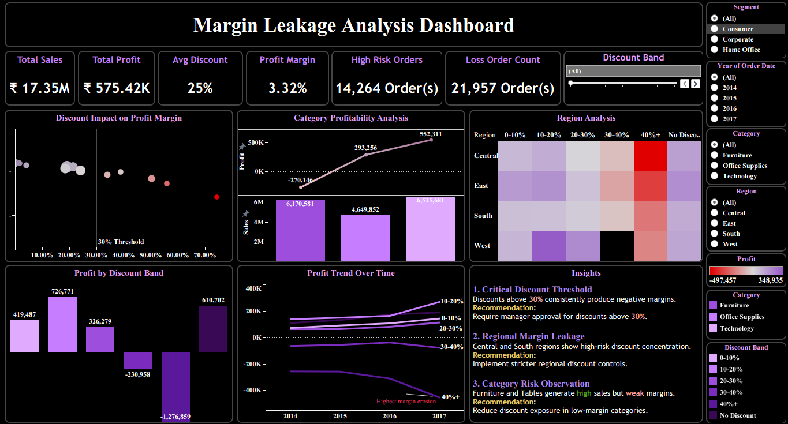

# 📊 Margin Leakage Analysis Dashboard

<p align="center">
  
</p>

<p align="center">


</p>

---

# 📖 Project Overview

The **Margin Leakage Analysis Dashboard** is an interactive Tableau dashboard developed to identify how discount strategies impact business profitability.

This project helps business stakeholders understand where margin leakage occurs by analyzing **discount bands, product categories, customer segments, regions, and yearly sales trends**, enabling data-driven pricing and discount decisions.

---

# 🎯 Business Problem

Many organizations increase discounts to drive sales, but excessive discounting often reduces profit margins and creates hidden financial losses.

This dashboard helps answer important business questions such as:

- Which discount levels reduce profitability?
- Which regions experience the highest margin leakage?
- Which product categories generate losses?
- Which customer segments are most profitable?
- What pricing strategy should the business adopt?

---

# 🚀 Dashboard Features

- 📌 Executive KPI Dashboard
- 📈 Discount vs Profit Margin Analysis
- 📊 Category Profitability Analysis
- 🌍 Regional Margin Leakage Heatmap
- 📉 Profit Trend Analysis
- 🎯 Dynamic Dashboard Filters
- 💡 Automated Business Insights
- ⚠ High-Risk Order Identification
- 📦 Loss Order Analysis

---

# 📊 Key Performance Indicators (KPIs)

| KPI | Description |
|------|-------------|
| 💰 Total Sales | Overall business sales |
| 💵 Total Profit | Total generated profit |
| 🎯 Average Discount | Average discount provided |
| 📈 Profit Margin | Overall profit margin percentage |
| ⚠ High Risk Orders | Orders with high discount risk |
| ❌ Loss Order Count | Total loss-making orders |

---

# 🛠 Tools & Technologies

- Tableau
- Calculated Fields
- Dashboard Actions
- Interactive Filters
- Data Visualization
- Business Intelligence
- KPI Dashboard Design

---

# 📈 Dashboard Insights

### 1️⃣ Critical Discount Threshold

- Discounts above **30%** consistently reduce profit margins.

### 2️⃣ Regional Margin Leakage

- Central and South regions show higher concentrations of margin leakage.

### 3️⃣ Category Risk

- Furniture generates high sales but lower profitability.

### 4️⃣ Business Recommendation

- Reduce high discount exposure.
- Review pricing strategies for low-margin categories.
- Implement discount approval policies for high-risk orders.

---

# 📂 Repository Structure

```
margin-leakage-analysis-dashboard
│
├── dashboard
│   └── Margin Leakage Dashboard.twb
│
├── dataset
│   └── Sample Superstore.csv
│
├── image
│   └── dashboard.png
│
├── README.md
└── report.docx
```

---

# 📷 Dashboard Preview

<p align="center">

</p>

---

# 📚 Skills Demonstrated

- Tableau Dashboard Development
- Business Intelligence
- KPI Development
- Data Visualization
- Pricing Analytics
- Profitability Analysis
- Interactive Dashboard Design
- Business Analytics

---

# 🔮 Future Improvements

- Real-time data integration
- Predictive pricing analytics
- AI-powered discount recommendations
- Customer segmentation analysis
- Sales forecasting

---

# 👨‍💻 Author

### Sarvesvaran G

**Aspiring Data Analyst**

- 💼 LinkedIn: https://www.linkedin.com/in/gsarvesvaran/
- 💻 GitHub: https://github.com/gsarvesvaran

---

## ⭐ If you found this project useful, consider giving it a Star!
